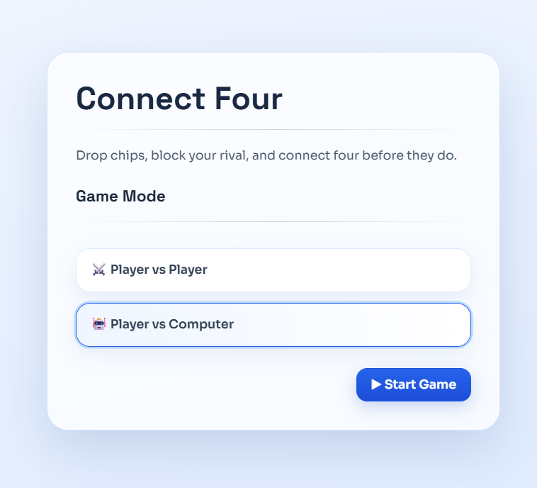
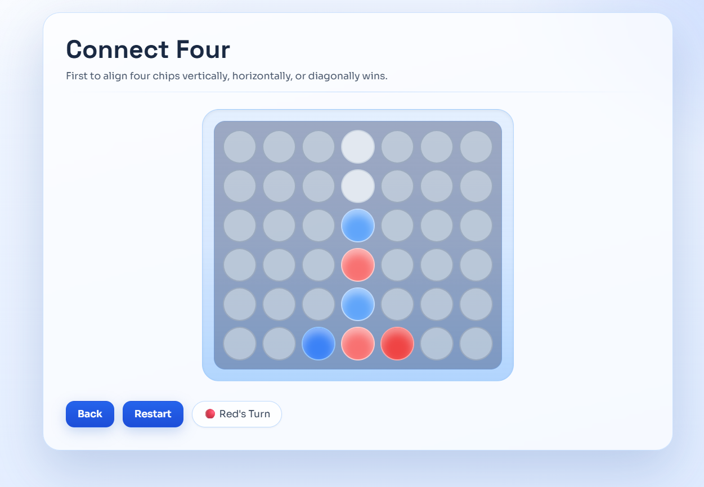
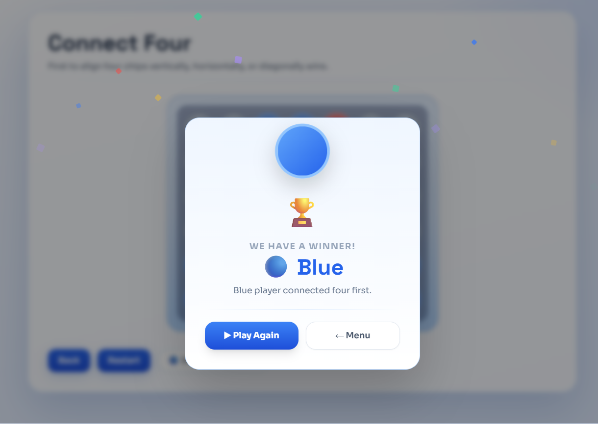

<!-- בס"ד -->
# Connect Four — React

A fully featured **Connect Four** game built with **React 18**, powered by a custom **Minimax AI** with alpha-beta pruning. Play against a friend locally or challenge the computer.

🎮 **Live Demo → [connect-four-react-six.vercel.app](https://connect-four-react-six.vercel.app/)**

---

## Preview

| Home | Gameplay | Winner |
|:---:|:---:|:---:|
|  |  |  |

---

## Features

- **Two Game Modes**
  - ⚔️ **Player vs Player** — local two-player mode with turn-based gameplay
  - 🤖 **Player vs Computer** — battle an AI that actually plays smart
- **Minimax AI with Alpha-Beta Pruning** — depth-7 search with heuristic board evaluation (centre preference, threat scoring, window analysis)
- **Column hover animations** — chips preview where they'll land before you drop
- **Win detection** — real-time check across all four directions (horizontal, vertical, both diagonals)
- **Clean, responsive UI** — built with Tailwind CSS, works on desktop and mobile
- **State management with Valtio** — reactive proxy-based state, no Redux boilerplate

---

## Tech Stack

| Layer | Technology |
|---|---|
| UI Framework | React 18 |
| Build Tool | Vite |
| Styling | Tailwind CSS |
| State Management | Valtio (proxy state) |
| AI Algorithm | Minimax + Alpha-Beta Pruning |
| Deployment | Vercel |

---

## Architecture Highlights

The project follows a clean **separation of concerns**:

```
src/
├── components/       # Reusable UI primitives (Button, Input, Modal…)
├── features/         # Feature-level components (Board, GameViews, Screens)
├── logics/           # Pure game logic — no React, fully testable
│   ├── TwoPlayersLogic.js
│   ├── OnePlayerLogic.js
│   └── BotLogic.js   ← Minimax engine lives here
├── controllers/      # Bridge between logic and UI state
├── model/            # Board and Status data models
└── context/          # React context for event handlers
```

- **Logic layer is completely decoupled from React** — game rules live in plain JS classes, making them easy to test and reuse.
- **Controllers** act as the glue between game logic and reactive UI state (Valtio proxies).
- **Minimax AI** evaluates positions using a scoring heuristic that rewards centre control, building threats, and immediately blocks the opponent's winning moves.

---

## Getting Started

```bash
# Install dependencies
npm install

# Start development server
npm run dev

# Build for production
npm run build
```

---

## AI — How the Bot Works

The computer opponent uses **Minimax with Alpha-Beta Pruning** at depth 7:

1. **Move ordering** — candidate columns are tried centre-first, which dramatically improves pruning efficiency.
2. **Early termination** — win/loss is detected immediately on the placed chip without scanning the entire board.
3. **Heuristic evaluation** — every window of 4 cells is scored based on how many bot/human chips and empty slots it contains, with extra weight given to centre column control and blocking the human's three-in-a-row threats.

---

## License

MIT
